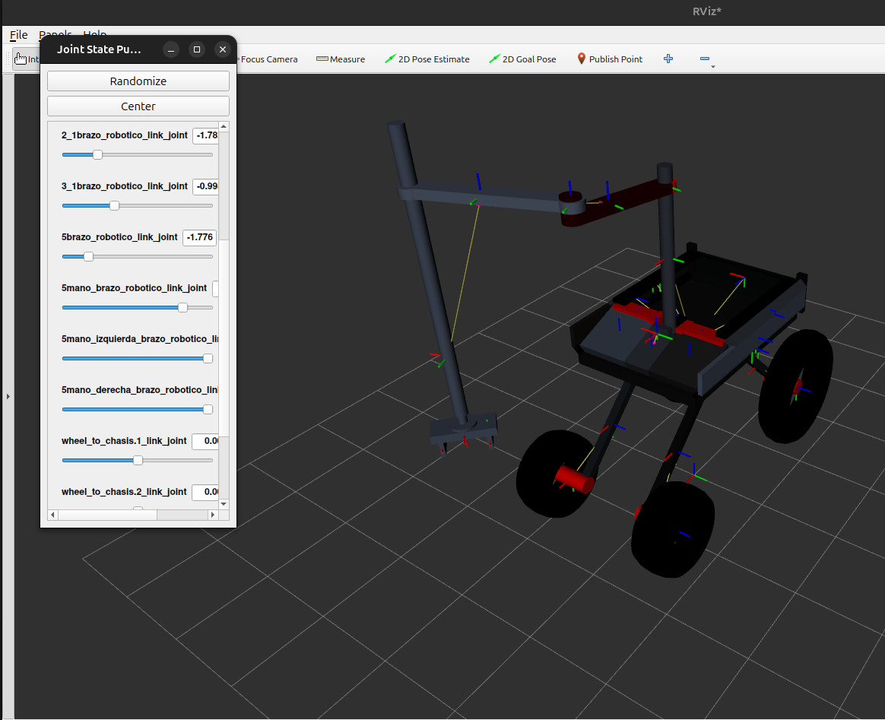
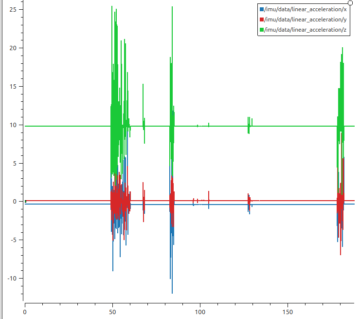

# Práctica 3
Daniel Guillén

Esta práctica tiene como objetivo la integración del robot modelado en blender en la práctica anterior dentro del entorno ROS2, así como el análisis de su comportamiento durante una operación de *pick and place* utilizando MoveIt2 y la simulación en Gazebo. Se han registrado y analizado datos relevantes como posiciones, aceleraciones y esfuerzo mecánico durante la operación.

A continuación, se presenta una explicación detallada de las imágenes y gráficas generadas durante la práctica.

---

## Enlace al rosbag

El rosbag utilizado para la obtención de las gráficas puede descargarse desde:  
[Descargar rosbag desde GitHub](https://github.com/dguillen2022/Daniel_Guillen_Practica3/tree/main/rosbag2_2025_05_16-19_36_37)

---

## Rviz [TF's and joint_state_publisher_gui]

Se observa el modelo del robot junto con los sliders del joint_state_publisher_gui viendo que estaba lanzado y 6 articulaciones aleatorias desplazadas. En este caso han sido el primer y segundo joint revolute del brazo, el joint prismatic que sube y baja el gripper, la mano que ha sido ligeramente rotada y los dedos del gripper que los he cerrado.

## Rviz [TF's and joint_state_publisher_gui]

Para llevara cabo esta imagen se ha desplazado el robot hasta el cubo, se ha movido el scrapper hasta el cubo, se ha cerrado el gripper y se ha subido el scrapper a la posición "hold" que es sujetarlo arriba.

## PDF del árbol de transformadas entre los links del robot.

[Ver árbol de transformadas (PDF)](Arbol_transformadas.pdf)

Todos los links parten del base_link que es la base del robot y este del base_footprint. Está el chasis, la jerarquía de las ruedas, las cuales parten de los ejes que a su vez parten del soporte y este del conector a la base. Y a la izquierda del todo se ve el brazo y su jerarquía.

## Imagen del gráfico posición de las ruedas.

En el gráfico de la posición se puede observa como desde todas las ruedas parten de una posición estable. Las ruedas de la derecha tienen valores negativos debido a que los joints están en el sentido contrario. Se puede ver el desplazamiento de las ruedas, el cual correspondería a avanzar y girar ligeramente a la izquierda para llegar al cubo. Se ve como en el segundo 22 llega a donde el cubo. Se mantiene en esa posición hasta el segundo 110. Finalmente, retrocede ligeramente.

## Imagen del gráfico aceleración

Esta gráfica muestra la aceleración registrada en los tres ejes (x, y, z) por el sensor IMU incorporado en el robot. Las componentes están codificadas por color:

    Azul: aceleración en el eje x (dirección longitudinal del robot).

    Rojo: aceleración en el eje y (lateral).

    Verde: aceleración en el eje z (vertical).

Se observa al inicio una fuerte perturbación indicando el avance y giro hacia el cubo. En el medio detecta también algo de movimiento y al final de la gráfica se puede ver el retroceso del coche que he llevado a cabo después de elevar el cubo.

## Imagen del gráfico gasto

Esta gráfica muestra el gasto parcial del brazo del robot.
Al inicio se ven unas ligeras oscilaciones donde el brazo se está moviendo hacia adelante, posicionandose encima del cubo y abriendo la pinza. Después se ve como después del minuto 18:02:30 hay una subida repentina lo que coincide con la bajada del brazo, cierre de pinza y elevación del brazo con el cubo sujeto. Se pueden ver oscilaciones a continuación indicando el movimiento del brazo mientras sujeta el cubo y mantiene la pinza cerrada sujetando el cubo. Y finalmente se ve como después del 18:03:30 suelta el cubo y la ultima oscilación es colocando el brazo ligeramente.