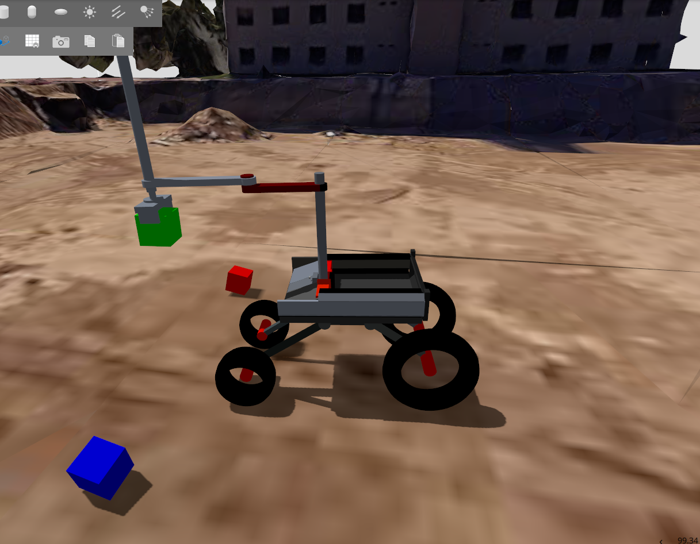

# Práctica 3
Daniel Guillén

Esta práctica tiene como objetivo la integración del robot modelado en blender en la práctica anterior dentro del entorno ROS2, así como el análisis de su comportamiento durante una operación de *pick and place* utilizando MoveIt2 y la simulación en Gazebo. Se han registrado y analizado datos relevantes como posiciones, aceleraciones y esfuerzo mecánico durante la operación.

A continuación, se presenta una explicación detallada de las imágenes y gráficas generadas durante la práctica.

---

## Enlace al rosbag

El rosbag utilizado para la obtención de las gráficas puede descargarse desde:  
[Descargar rosbag desde GitHub](https://github.com/dguillen2022/Daniel_Guillen_Practica3/tree/main/rosbag2_2025_05_16-19_36_37)

---

## Rviz [TF's and joint_state_publisher_gui]

Se observa el modelo del robot junto con los sliders del joint_state_publisher_gui viendo que estaba lanzado y 6 articulaciones aleatorias desplazadas. En este caso han sido el primer y segundo joint revolute del brazo, el joint prismatic que sube y baja el gripper, la mano que ha sido ligeramente rotada y los dedos del gripper que los he cerrado.

## Rviz [TF's and joint_state_publisher_gui]

Para llevara cabo esta imagen se ha desplazado el robot hasta el cubo, se ha movido el scrapper hasta el cubo, se ha cerrado el gripper y se ha subido el scrapper a la posición "hold" que es sujetarlo arriba.

## PDF del árbol de transformadas entre los links del robot.

